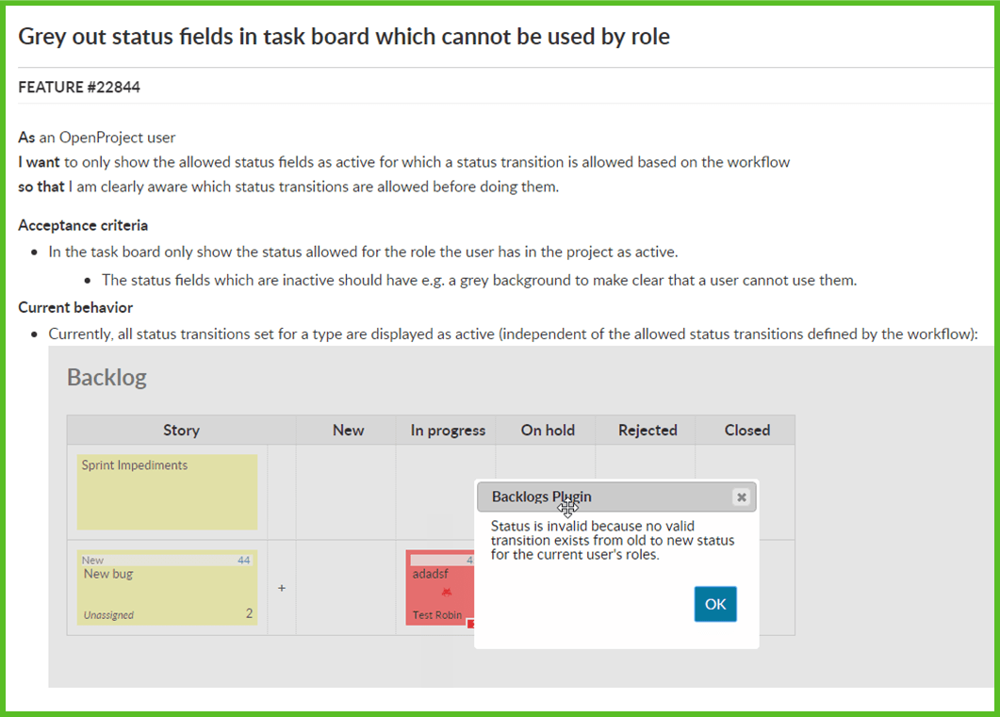

---
sidebar_navigation:
  title: Submit a feature idea
  priority: 990
description: How to submit an idea for a feature for OpenProject
keywords: feature requests, ideas, open feature request
---
# Submit a feature idea

## How to submit a feature idea or request

1. Login to or register at the [OpenProject community platform](https://community.openproject.org/). It's fast and free. Please note: In order to create an account, please write an email with the subject 'Joining community' to [support@openproject.com](mailto:support@openproject.com).
2. Use the search bar in the header navigation on top to look for similar feature requests. If there's one, please leave a comment or add additional information. Otherwise:
3. Open the [feature create form](https://community.openproject.org/projects/openproject/work_packages/new?type=6).
4. Add a subject and detailed description using the template.
5. Attach a file (optional).
7. Press **Create**.

## Feature idea guideline

### Subject

* The subject of the feature request should be as concise and crisp as possible.

**Example:**

[Backlogs] Grey out status fields in task board which cannot be used by role

### Description

* The feature description should be concise and expressive.
* Mention the reason why the change is relevant. Describe the associated use case.
* Add acceptance criteria for clarification.
* Describe the current behavior if it is to be changed by the request.
* Using the following (user story) format, describe the intent behind a new feature request:

**Example:**

AS an OpenProject user 
I WANT to only show the allowed status fields as active for which a status transition is allowed based on the workflow 
SO THAT I am clearly aware which status transitions are allowed before doing them.

### Acceptance criteria

* State and detail the requirements in the acceptance criteria.

**Example:**

* In the task board only show the status allowed for the role the user has in the project as active.
  * The status fields which are inactive should have e.g. a grey background to make clear that a user cannot use them.

### Current behavior

* If the feature request is changing existing behavior, briefly explain the current behavior.

**Example:**

> Currently, all status transitions set for a type are displayed as active (independent of the allowed status transitions defined by the workflow).

### Wireframes / Screenshots

* If the request is visual, it is helpful to add a short wireframe or a screenshot in which changes are highlighted.
* The wireframe or screenshot can be attached as a file and can be integrated in the description with the following syntax: "!Name_of_screenshot.png!" (without quotation marks)
(Notice: Name_of_screenshot should be replaced with the respective name of the file. The file ending (here: .png) has to be adjusted to the appropriate file type of the screenshot.)

## Example of a feature request

