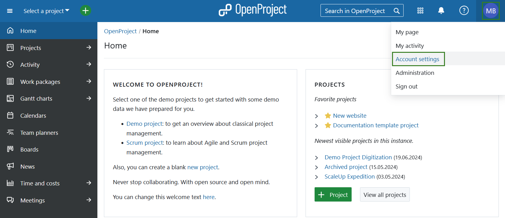

---
sidebar_navigation:
  title: Account settings
  priority: 400
description: Learn how to configure account settings.
keywords: my account, account settings, change language
---

# Account settings

Under  **Account settings**, you can change your personal settings, such as the language, edit notifications, or add an avatar. Moreover you can manage access tokens and sessions.

> [!TIP]
> Prior to OpenProject 15.0 *Account settings* were named *My account*.

To open your personal settings in OpenProject, click on your user icon in the top right corner in the header of the application and choose **Account settings**.

For more details please take a look at [**Account settings** section of OpenProject user guide](../../user-guide/account-settings).

