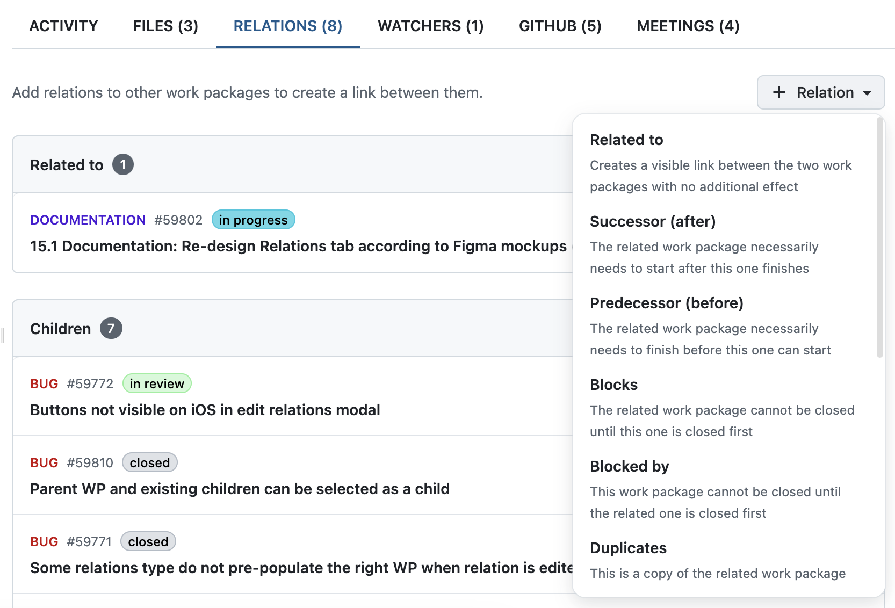
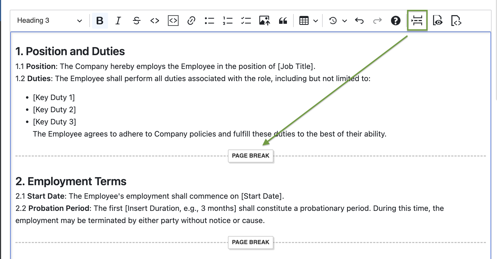

# OpenProject 15.1.0

Release date: 2024-12-11

We released [OpenProject 15.1.0](https://community.openproject.org/versions/2122). The release contains several bug fixes, and we recommend updating to the newest version.
In these Release Notes, we will give an overview of important feature changes and technical updates. At the end, you will find a complete list of all changes and bug fixes.

## Important feature changes

### Custom fields of type hierarchy (Enterprise add-on)

Enterprise customers can now use a new type of custom field that allows **multi-level selections in a hierarchial way**. This makes it easier for users to organize and navigate complex data in structured, multi-level formats within work packages. The new custom fields of the hierarchy type can be added to work packages and then structured into several lower-level items.

Each custom field of type hierarchy can be given a short name (e.g. B for Berlin). Here's an example of how custom fields of the hierarchy type look like, using the example of a detailed assignment of workspaces:

[Read all about this new type of custom field in our system admin guide](../../system-admin-guide/custom-fields/#hierarchy-custom-field-enterprise-add-on).

### Redesign of the Relations tab in work packages

The Relations tab in work packages has been completely redesigned using Primer design system, including a **new dropdown menu that allows you to directly choose the type of relation**, e.g. if the related work package is a successor (earlier called 'Follows') and necessarily needs to start after the selected one finishes. Scroll down to see more types of relations.

Additionally, you can now add a description to add further information about the relation. Please note that the description will be displayed on both work packages, below the related other work package.

> [!NOTE]
> Important information: With this redesign, **you will no longer be able to create new work packages directly on the Relations tab**. We are already working on a solution and plan to release this feature early next year. Thank you for your understanding.

> [!TIP]
> As a workaround you can [include a table of related work packages to work package forms (Enterprise add-on)](../../system-admin-guide/manage-work-packages/work-package-types/#add-table-of-related-work-packages-to-a-work-package-form-enterprise-add-on). Under this table you can directly create new children work packages or link existing ones. 

[Read all about work package relations and hierarchies in our user guide](../../user-guide/work-packages/work-package-relations-hierarchies/).

### Redesign of the Meetings index page

The index page of the Meetings module has been redesigned with Primer as well, making it easier to read and adding a more modern look. You see your list of meetings in column view, with the columns being: Title, Date and time, Duration, and Location.

The + Meeting button in the top right corner now offers a dropdown menu where you can directly choose whether you want to add a dynamic or a classic meeting.

Here's an example screenshot of the redesigned Meetings index page:

[Learn what is possible with OpenProject's Dynamic Meetings to improve collaboration with your colleagues](../../user-guide/meetings/dynamic-meetings/).

### Manual page breaks in PDF work package exports

With our work package export feature, people can generate good-looking PDFs. Sometimes, however, the page break comes at an inconvenient place. With version 15.1, users can now force a manual page break in the work package description. This ensures, for example, that a signature can always be inserted on the correct page. Please note that logically, manual page breaks only work if the work package description is part of the PDF export – and not in the PDF export of a work package table if you choose the export type 'Table'.

[Learn how to export work packages and what options you have](../../user-guide/work-packages/exporting/).

### Zen mode for project lists

Zen mode allows users to focus on a certain page, as all other menu items and elements are hidden, and the page is displayed in full screen. OpenProject already offers zen mode for other modules like Work packages, Boards, Gantt charts or Calendars – and with version 15.1 also for project lists.

Here is how zen mode for project lists looks like:

[Read all about OpenProject's project lists in our user guide](../../user-guide/projects/project-lists/).

## Important technical updates

### Possibility to lock seeded admin users, e.g. when using LDAP

Administrators of automated deployments can now choose to skip the automatically integrated creation of an admin user. This is useful if you have set up an LDAP or SSO integration – such as those used for openDesk environments – and you want to prevent the admin user from logging in. Administrators no longer have to manually disable this automatically created admin user and thus run the risk of forgetting to do so, which would pose a security risk.

Read more about [seeding through environment for OpenProject configuration in our Installation & operations guide](../../installation-and-operations/configuration/#seeding-through-environment).

<!--more-->

## Bug fixes and changes

<!-- Warning: Anything within the below lines will be automatically removed by the release script -->
<!-- BEGIN AUTOMATED SECTION -->

- Feature: Multi-level selection fields to support custom hierarchical attributes \[[#36033](https://community.openproject.org/wp/36033)\]
- Bugfix: Unsorted &quot;User&quot; list in &quot;Time and costs&quot; \[[#43829](https://community.openproject.org/wp/43829)\]
- Bugfix: 500 when filtering by date field and specifying too big number \[[#55393](https://community.openproject.org/wp/55393)\]
- Bugfix: Sorting by custom field has strong impact on performance for the project list \[[#57305](https://community.openproject.org/wp/57305)\]
- Bugfix: Absent value for custom field is ordered not consistently at the beginning or end for different formats \[[#57554](https://community.openproject.org/wp/57554)\]
- Bugfix: Notification on a mention added to an edited comment is not triggered \[[#58007](https://community.openproject.org/wp/58007)\]
- Bugfix: Info box on new custom field of type hierarchy is permanent \[[#58466](https://community.openproject.org/wp/58466)\]
- Bugfix: Item add form disappears after added a new item to a custom field of type hierarchy \[[#58467](https://community.openproject.org/wp/58467)\]
- Bugfix: Using multi-select and required options do not work \[[#58635](https://community.openproject.org/wp/58635)\]
- Bugfix: HTML files served as plain text \[[#58646](https://community.openproject.org/wp/58646)\]
- Bugfix: Performance issues on work\_packages api endpoint \[[#58689](https://community.openproject.org/wp/58689)\]
- Bugfix: Breadcrumb of hierarchy items has left margin \[[#58700](https://community.openproject.org/wp/58700)\]
- Bugfix: Missing hint in comment box label \[[#59060](https://community.openproject.org/wp/59060)\]
- Bugfix: Automatic comments to indicate retractions miss a stem (newest on top) \[[#59278](https://community.openproject.org/wp/59278)\]
- Bugfix: Add local spacing to inline enterprise banner \[[#59284](https://community.openproject.org/wp/59284)\]
- Bugfix: Hierarchy custom fields causing 500 on custom actions \[[#59354](https://community.openproject.org/wp/59354)\]
- Bugfix: Files count badge missing in Files tab (WP full view) \[[#59391](https://community.openproject.org/wp/59391)\]
- Bugfix: Signing in after two factor methods have been deleted lead to a 500 error \[[#59408](https://community.openproject.org/wp/59408)\]
- Bugfix: User without permission to &quot;Save views&quot; can save changes to work package views \[[#59479](https://community.openproject.org/wp/59479)\]
- Bugfix: Double provider showing on OpenID provider list \[[#59510](https://community.openproject.org/wp/59510)\]
- Bugfix: SAML provider not available when migrated with idp\_cert\_fingerprint \[[#59535](https://community.openproject.org/wp/59535)\]
- Bugfix: Hierarchy items not correctly displayed if custom field is shown in wp table \[[#59572](https://community.openproject.org/wp/59572)\]
- Bugfix: Export of an unsaved query not working properly \[[#59781](https://community.openproject.org/wp/59781)\]
- Bugfix: No comments possible for shared work packages that were shared with &quot;Comment&quot; permission \[[#59785](https://community.openproject.org/wp/59785)\]
- Bugfix: Missing space between project selector and &quot;include sub-projects&quot;-checkbox \[[#59795](https://community.openproject.org/wp/59795)\]
- Bugfix: Work package create button doesn&#39;t work on mobile Web \[[#59828](https://community.openproject.org/wp/59828)\]
- Bugfix: Trailing &#39; in journal diff parameter activity\_page breaks page \[[#59865](https://community.openproject.org/wp/59865)\]
- Bugfix: Regression: Meeting sorted in reverse order \[[#59908](https://community.openproject.org/wp/59908)\]
- Bugfix: Not possible to update auto-discovered values \[[#59928](https://community.openproject.org/wp/59928)\]
- Bugfix: Form buttons are left aligned and not right aligned in hierarchy items form \[[#59978](https://community.openproject.org/wp/59978)\]
- Feature: Work package PDF export: Insert page breaks \[[#44047](https://community.openproject.org/wp/44047)\]
- Feature: Zen mode for project lists page \[[#52150](https://community.openproject.org/wp/52150)\]
- Feature: Create and edit custom field of type hierarchy \[[#57806](https://community.openproject.org/wp/57806)\]
- Feature: Enable ordering of hierarchy values of same level \[[#57820](https://community.openproject.org/wp/57820)\]
- Feature: Enable assignment of hierarchy values to work packages \[[#57824](https://community.openproject.org/wp/57824)\]
- Feature: Enable filtering on custom fields of type hierarchy \[[#57825](https://community.openproject.org/wp/57825)\]
- Feature: Primerised Meeting index pages \[[#57854](https://community.openproject.org/wp/57854)\]
- Feature: Re-design Relations tab according to  Figma mockups (Primerise) \[[#58345](https://community.openproject.org/wp/58345)\]
- Feature: Move primary action to subheader \[[#58636](https://community.openproject.org/wp/58636)\]
- Feature: Validate uniqueness of short names of hierarchy items \[[#58852](https://community.openproject.org/wp/58852)\]
- Feature: Add enterprise gateway to creation of custom fields of type hierarchy \[[#58865](https://community.openproject.org/wp/58865)\]
- Feature: Primer: Implement proper mobile behaviour for BoxTable \[[#59248](https://community.openproject.org/wp/59248)\]
- Feature: Allow locking of the seeded admin user \[[#59722](https://community.openproject.org/wp/59722)\]
- Feature: Remove feature flag custom\_field\_of\_type\_hierarchy \[[#59864](https://community.openproject.org/wp/59864)\]

<!-- END AUTOMATED SECTION -->
<!-- Warning: Anything above this line will be automatically removed by the release script -->

## Contributions

A very special thank you goes to Deutsche Bahn and City of Cologne for sponsoring parts of this release. Your support, alongside the efforts of our amazing Community, helps drive these innovations.

Also, a big thanks to our Community members for reporting bugs and helping us identify and provide fixes. Special thanks for reporting and finding bugs go to Bill Bai, Sam Yelman, Knight Chang, Gábor Alexovics, Gregor Buergisser, Andrey Dermeyko, Various Interactive, Clayton Belcher, Александр Татаринцев, and Keno Krewer.

Last but not least, we are very grateful for our very engaged translation contributors on Crowdin, who translated quite a few OpenProject strings! This release we would like to highlight
- [Alexander Aleschenko](https://crowdin.com/profile/top4ek), for a great number of translations into Russian.
- [José Helbert Pina](https://crowdin.com/profile/GZTranslations), for a great number of translations into Portuguese.
- [BigSeung](https://crowdin.com/profile/BigSeung), for a great number of translations into Korean.

Would you like to help out with translations yourself? Then take a look at our [translation guide](../../contributions-guide/translate-openproject/) and find out exactly how you can contribute. It is very much appreciated!
