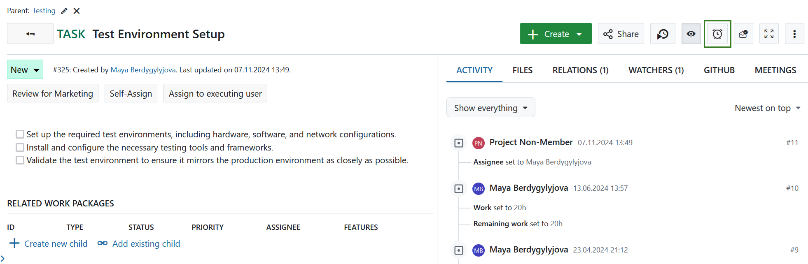
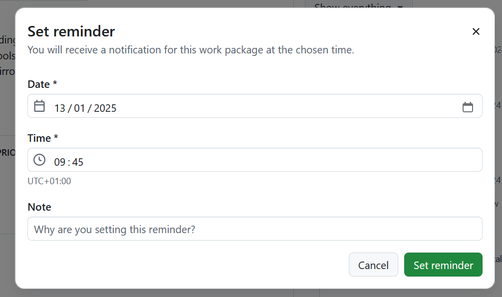
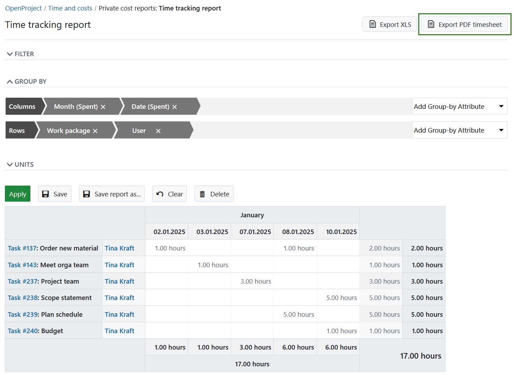
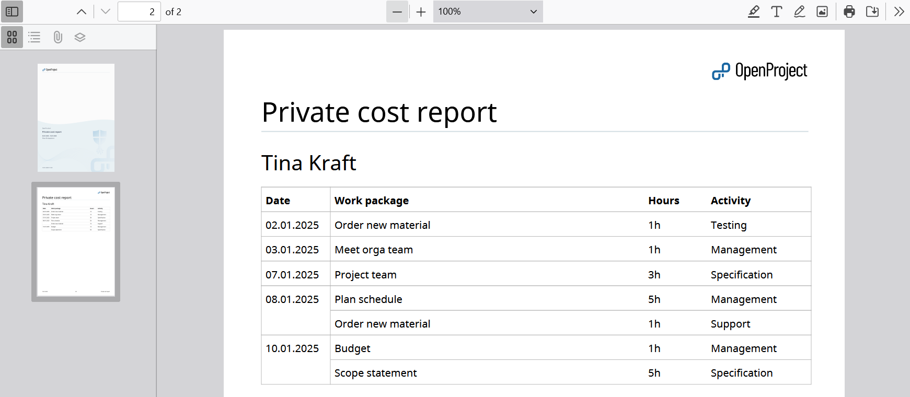
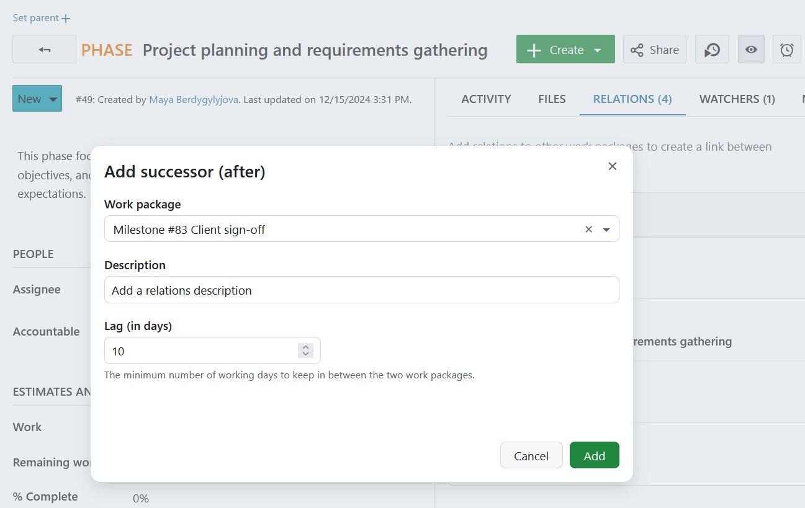
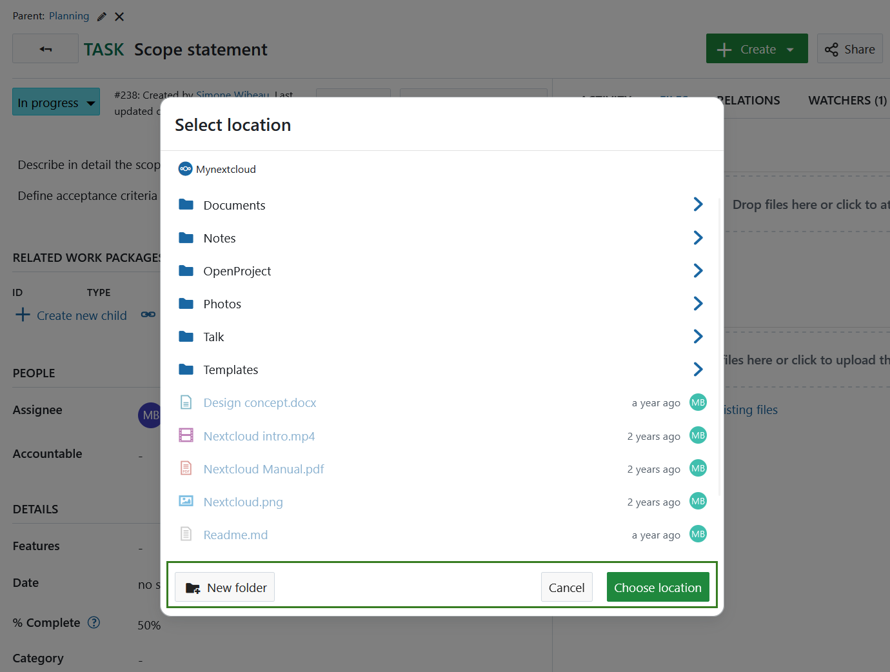
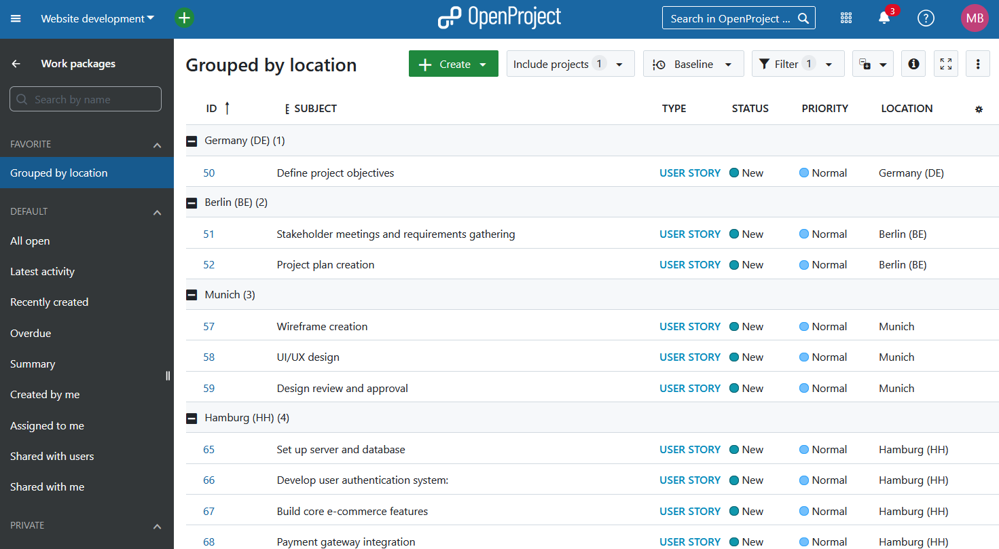
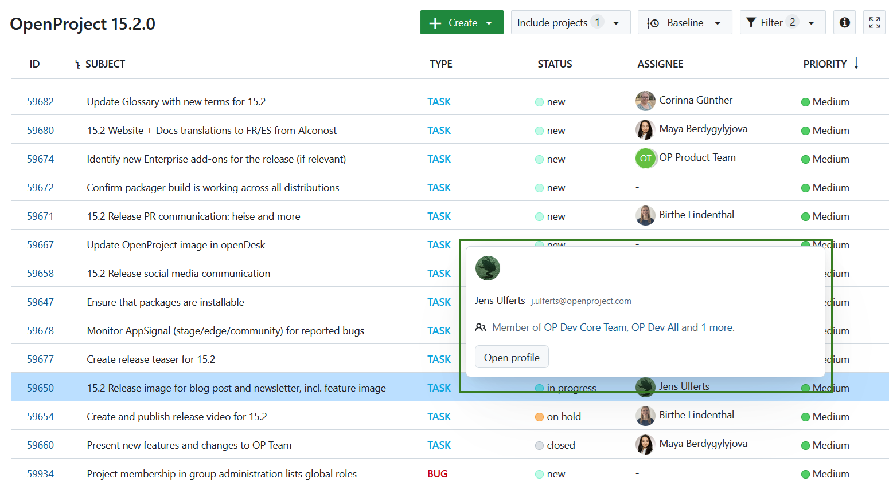

# OpenProject 15.2.0

Release date: 2025-01-22

We released [OpenProject 15.2.0](https://community.openproject.org/versions/2143). The release contains several bug fixes, and we recommend updating to the newest version.
In these Release Notes, we will give an overview of important feature changes. At the end, you will find a complete list of all changes and bug fixes.

## Important feature changes

### Work package reminders

You can now use the Reminder function to receive a reminder about a work package at a later point in time. Simply navigate to any work package, select the **Reminder icon** and specify when you would like to be reminded. You will receive a notification in the notification center. 

> [!TIP]
> You can also receive immediate notifications via e-mail for personal reminders. To do that, [adjust your account settings](../../user-guide/account-settings/#email-reminders) accordingly.

[Read more about setting work package reminders](../../user-guide/work-packages/edit-work-package/#work-package-reminders).

### Export timesheets as PDF

Time reports can now be exported not only in Excel, but also in PDF format. Navigate to the Time and costs module of your project, specify all report filters according to your needs, and press the **Export PDF timesheet** button. 

Here is an example of a timesheet PDF export:

> [!TIP]
> Keep in mind that this time report will only include time entries, but not the cost ones.

[Learn how to export timesheets as PDF](../../user-guide/time-and-costs/reporting/#export-time-sheets).

### Add a lag to Predecessor/Successor relations

For Predecessor/Successor relations, you can now specify a **lag**, which represents the minimum number of working days to maintain between two work packages. This flexibility ensures more precise scheduling and helps align task dependencies effectively. By default, the lag is set to 0 working days, but you can update the *Description* and *Lag* fields anytime to adapt to changes in your project timeline.

[Read more about work package relations](../../user-guide/work-packages/work-package-relations-hierarchies).

### Create a new folder directly when using file storages integrations

Users can now create a folder structure directly while selecting the destination folder for file uploads, enhancing the integration with both **Nextcloud** and **OneDrive/SharePoint**. This improvement simplifies the process by allowing users to organize their files during the upload, without the need to separately create folders in the file storage, thus streamlining workflows and improving overall efficiency.

### Group and order by for custom fields of type hierarchy

Users can now sort their work package list by the assigned values of custom fields of type hierarchy. This enhancement allows for a more efficient overview, helping users quickly organize and filter work packages within a specific hierarchical context. Here is an example of how work packages grouped by a custom field of a type hierarchy looks like:

### Popover on user information on hover

To simplify accessing specific user details without needing to navigate to their profile, user information will now be displayed when hovering over a user's avatar, on pages like the Members or Activity page.

### Continued updating page headers and subheaders

We continued introducing standardized components for page headers and subheaders across multiple project pages, to further improve design consistency. 

[Find out which pages have been updated in the associated work package for these design updates](https://community.openproject.org/projects/openproject/work_packages/53810).

## Bug fixes and changes

<!-- Warning: Anything within the below lines will be automatically removed by the release script -->
<!-- BEGIN AUTOMATED SECTION -->

- Feature: Edit lag to follow-precedes-relations \[[#22360](https://community.openproject.org/wp/22360)\]
- Feature: Create new folder from within the location picker \[[#46811](https://community.openproject.org/wp/46811)\]
- Feature: Update PageHeaders &amp; SubHeaders in the (rails) project pages (Part 1) \[[#53810](https://community.openproject.org/wp/53810)\]
- Feature: Popover for user information on hover \[[#55581](https://community.openproject.org/wp/55581)\]
- Feature: Enable group by CF hierarchy for the work package query \[[#59174](https://community.openproject.org/wp/59174)\]
- Feature: Basic functionality of work package &quot;Reminders&quot;, scheduling &quot;Reminder&quot; notifications \[[#59436](https://community.openproject.org/wp/59436)\]
- Feature: Enable ordering for work packages on values of custom fields of type hierarchy \[[#59766](https://community.openproject.org/wp/59766)\]
- Feature: When adding new relations, auto-scroll to show the newly added relation \[[#59769](https://community.openproject.org/wp/59769)\]
- Feature: Create new icon for setting reminders \[[#59793](https://community.openproject.org/wp/59793)\]
- Feature: Export cost query as timesheet PDF \[[#59824](https://community.openproject.org/wp/59824)\]
- Feature: Improve comprehensibility of the &quot;Add relations&quot; modal \[[#60462](https://community.openproject.org/wp/60462)\]
- Bugfix: Mobile: tap twice on comment input to start typing \[[#57107](https://community.openproject.org/wp/57107)\]
- Bugfix: Activity panel (Notification center goes into mobile layout even on a desktop when the browser on desktop \[[#59235](https://community.openproject.org/wp/59235)\]
- Bugfix: Folders missing in log lines for &quot;Unexpected Content Error&quot; \[[#59346](https://community.openproject.org/wp/59346)\]
- Bugfix: Activity tab does not scroll to the bottom or correct comment on mobile \[[#59458](https://community.openproject.org/wp/59458)\]
- Bugfix: Activity only shows 1 value even if several were updated \[[#59855](https://community.openproject.org/wp/59855)\]
- Bugfix: User Hovercard rendering is bumpy \[[#59879](https://community.openproject.org/wp/59879)\]
- Bugfix: User hovercard is showing on User own profile page and other users profile page \[[#59898](https://community.openproject.org/wp/59898)\]
- Bugfix: User hovercard is showing behind the Meeting participants overlay \[[#59907](https://community.openproject.org/wp/59907)\]
- Bugfix: Impossible to group by CF hierarchy multi-select \[[#59920](https://community.openproject.org/wp/59920)\]
- Bugfix: Proto plugin dose not work with OpenProject 15 \[[#59931](https://community.openproject.org/wp/59931)\]
- Bugfix: Project membership in group administration lists global roles \[[#59934](https://community.openproject.org/wp/59934)\]
- Bugfix: Internal server error on Azure OIDC login with expired client secret \[[#59960](https://community.openproject.org/wp/59960)\]
- Bugfix: OpenID setup fails due to Claims is not a valid JSON object \[[#59962](https://community.openproject.org/wp/59962)\]
- Bugfix: Wrong locale of error message while personal API access token creation \[[#60025](https://community.openproject.org/wp/60025)\]
- Bugfix: Filter translations for Meetings Module missing \[[#60113](https://community.openproject.org/wp/60113)\]
- Bugfix: Saving a new WP triggers browser warning message \[[#60133](https://community.openproject.org/wp/60133)\]
- Bugfix: Meeting creator is not added as invitee by default + All meetings menu point should not have a filter by default \[[#60287](https://community.openproject.org/wp/60287)\]
- Bugfix: Titles do not always use App Title \[[#60371](https://community.openproject.org/wp/60371)\]
- Bugfix: No connection error after folder creation in file picker \[[#60384](https://community.openproject.org/wp/60384)\]
- Bugfix: Non working days not shown on calendar widget \[[#60410](https://community.openproject.org/wp/60410)\]
- Bugfix: Distance between sticky buttons and form field above is too small in scrollable modals \[[#60430](https://community.openproject.org/wp/60430)\]
- Bugfix: Reminders generate two or more lines for a work package in notification center, clicking one selects all \[[#60449](https://community.openproject.org/wp/60449)\]
- Bugfix: The &#39;set reminder&#39; action is available to users who are not signed in \[[#60458](https://community.openproject.org/wp/60458)\]
- Bugfix: ActionView::Template::Error happening in MessagesController#show  \[[#60478](https://community.openproject.org/wp/60478)\]
- Bugfix: Reminder menu item is not placed correctly \[[#60501](https://community.openproject.org/wp/60501)\]
- Bugfix: Vanishing filters in &quot;Work package table&quot;-widgets  \[[#60546](https://community.openproject.org/wp/60546)\]
- Bugfix: Remove permission restriction for users to set their own reminders \[[#60568](https://community.openproject.org/wp/60568)\]
- Bugfix: Relations dropdown capitalizes wrong in German \[[#60627](https://community.openproject.org/wp/60627)\]

<!-- END AUTOMATED SECTION -->
<!-- Warning: Anything above this line will be automatically removed by the release script -->

## Contributions
A heartfelt thank you to the City of Cologne and ZenDiS for sponsoring parts of this release. Your support, combined with the incredible efforts of our Community, continues to drive these innovations forward.

Also a big thanks to our Community members for reporting bugs and helping us identify and provide fixes. Special thanks for reporting and finding bugs go to Stefan Weiberg.

Last but not least, we are very grateful for our very engaged translation contributors on Crowdin, who translated quite a few OpenProject strings! This release we would like to highlight
- [atifahnordin](https://crowdin.com/profile/atifahnordin), for an outstanding number of translations into Malay.
- [Vlastislav Dockal](https://crowdin.com/profile/vdockal), for a great number of translations into Czech.
- [Alin Marcu](https://crowdin.com/profile/deconfcom), for a great number of translations into Romanian.
- [Yuliia Pavliuk](https://crowdin.com/profile/pav.yulia), for a great number of translations into Ukrainian.

Would you like to help out with translations yourself? Then take a look at our [translation guide](../../contributions-guide/translate-openproject/) and find out exactly how you can contribute. It is very much appreciated!
