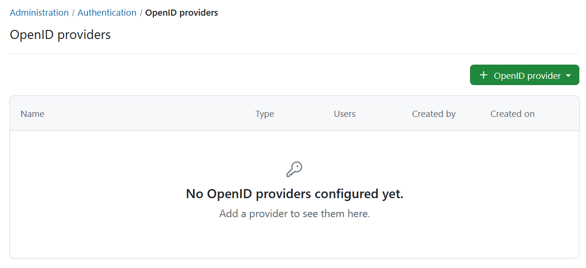
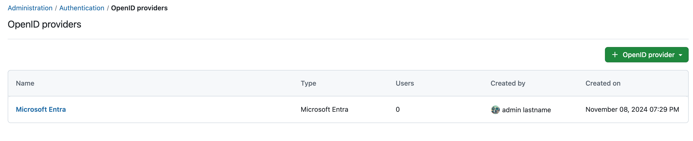

---
sidebar_navigation:
  title: OpenID providers
  priority: 800
description: OpenID providers for OpenProject.
keywords: OpenID providers
---
# OpenID providers (Enterprise add-on)

> [!IMPORTANT] 
> OpenID Connect providers is an Enterprise add-on. If you do not see the button you will have to activate the Enterprise edition first.

| Topic                                                              | Content                                                                         |
|--------------------------------------------------------------------|---------------------------------------------------------------------------------|
| Login with [Google Workspace](#google)                             | How to use Google Workspace as an SSO provider for OpenProject?                 |
| [Microsoft Entra ID](#microsoft-entra) (previously Azure)          | How to use Microsoft Azure Active Directory as an SSO provider for OpenProject? |
| [Custom OpenID Connect Providers](#custom-openid-connect-provider) | Configuration of additional OpenID Connect providers.                           |
| [Troubleshooting](#troubleshooting)                                | Common complications when using OpenID as SSO.                                  |

To activate and configure OpenID providers in OpenProject, navigate to *Administration* -> *Authentication* and choose -> *OpenID providers*.

## Add a new OpenID Connect provider

To add a new OpenID provider, click the green **+ OpenID provider** button.

 


You can create different kinds of providers with a different set of properties. You can choose from:

- [Google](#google)
- [Microsoft Entra ID](#microsoft-entra) (previously Azure)
- [Custom OpenID Connect Providers](#custom-openid-connect-provider)


## Google

### Step 1: Create the OAuth consent screen

1. Navigate to your GCP console.  (https://console.cloud.google.com/)
2. Go to **APIs & Services** > OAuth consent screen.


3. Create a new project and a new app or edit an existing project and an existing app, setting the following fields (should be internal):
   1. **App name** (e.g. EXAMPLE.COM SSO)
   2. **User support email** (e.g. user-support@example.com)
   3. **App domains** (at minimum, you must provide the Application home page - e.g. `https://example.openproject.com`)
   4. **Authorized domains** (e.g. openproject.com)
   5. **Developer Contact information** (e.g.  developer@example.com)
   6. Click **SAVE AND CONTINUE** to proceed.


4. **Scopes** - Press **SAVE AND CONTINUE**
5. **Summary** - Press **SAVE AND CONTINUE**

### Step 2: Create the OAuth Client

1. Under **APIs & Services**, go to **Credentials**.


2. Click **Create Credentials** and select **OAuth Client ID**.

   1. When prompted for your **Application type**, choose **Web Application**.

   2. Provide a **Name** for your application. (e.g. example-openproject.com)

   3. Under Authorized redirect URIs, click **Add URI**, and provide your URI (e.g. [example.openproject.com]/auth/google/callback).

   4. Click **CREATE** or **SAVE** .


After pressing **CREATE** you will see a following pop-up window.

> [!TIP]
> Make sure to note your **Client ID** and **Client Secret**.


### Step 3: Add Google as an OpenID Provider to OpenProject

1. Login as OpenProject Administrator
2. Navigate to *Administration* -> *Authentication* and choose -> *OpenID providers*. 
   - **Click** the green *+ OpenID Connect provider* button
   - **Choose** Choose the Option Google
   - Set a **Display Name**, this is the name of the login button shown to users.
   - On the next section, set **Client ID** and **Client Secret** (from step 2)
   - Enable **Limit self registration** option if you want users that create accounts with this provider to bypass the configured limit for self-registration.


Press **Finish setup** to save the client and complete. If you go back to the index page of OpenID connect providers, the new provider should be visible.


## Microsoft Entra

### Step-by-step

#### Step 1: Register an App in Azure Active Directory

If your organization currently has an Azure Active Directory to manage users, and you want to use that to log in to OpenProject, you will need to register a new *App*.

The steps are as follows:

1. Log into your Microsoft account, and go to the Azure Active Directory administration page.


2. In the sidebar, click **All services**.


3. Click  the link named **App registrations**.


4. Click **New registration**.


5. You will then be asked to specify the following settings:

* For **Name**, enter *OpenProject*.
* For **Supported account types**, select *Accounts in this organization directory only*.
* For **Redirect URI**, select the *Web* type, and enter the URL to your OpenProject installation, followed by */auth/oidc-microsoft-entra/callback*. For instance: "https://myserver.com/auth/oidc-microsoft-entra/callback".

> [!NOTE]
>
> The Redirect URI is dependent on the display name that you choose later on. You might need to change it to the correct value shown in the administration of OpenProject.

6. When you are done, click the **Register** button at the end of the page. You will be redirected to your new App registration.

> [!IMPORTANT]
> Make sure to save the **Application (client) ID** that is now displayed. You will need it later.


7. You can then click **Certificates & secret**.


8. Then click **New client secret**, set the description to *client_secret*, and the expiration to *730 days (24 months)*. Then click **Add**.


9. A secret should have been generated and will be displayed on the page. 

> [!IMPORTANT]
> Make sure to save it because it will only be displayed once.


At the end of this step, you should have a copy of the Application client ID as well as the client Secret you just generated.

### Step 2: Configure OpenProject

Next, you need to create the OpenID Connect provider in OpenProject:

1. Login as OpenProject Administrator
2. Navigate to *Administration* -> *Authentication* and choose -> *OpenID providers*. 
   - **Click** the green *+ OpenID Connect provider* button
   - **Choose** Choose the option **Microsoft Entra**
   - Set display name **Microsoft Entra**. Please note that if you change this value, the redirect URI in step 1) might change. The redirect URI is shown in the side panel on the right side once you saved the configuration.
   - Set the **Tenant**: By default, OpenProject will use the Microsoft Graph API endpoint to perform user info requests.
     For that, you will need to enter the correct tenant identifier for your Azure instance.
     To find the correct value for your instance, [please see this guide](https://learn.microsoft.com/en-us/azure/active-directory/develop/v2-protocols-oidc#find-your-apps-openid-configuration-document-uri).
   - In the next section, set **Client ID** and **Client Secret** (from step 1)
   - Enable **Limit self registration** option if you want users that create accounts with this provider to bypass the configured limit for self-registration.


Press **Finish setup** to save the client and complete. If you go back to the index page of OpenID connect providers, the new provider should be visible. There you will see the redirect URI on the right side in case you set a custom display name.

 Congratulations, your users can now authenticate using your Microsoft Entra ID provider using the button in the Login form.

## Custom OpenID Connect Provider

Starting with OpenProject 15.0., you can also create custom OpenID Connect providers using the user interface.

To start creating a custom provider, please follow these steps:

1. Login as OpenProject Administrator
2. Navigate to *Administration* -> *Authentication* and choose -> *OpenID providers*. 
   - **Click** the green *+ OpenID Connect provider* button
   - **Choose** the *Option* **Custom**

### Step-by-step

#### Step 1: Display name

- Set a **Display Name**, this is the name of the login button shown to users. Let's assume we're trying to connect *Keycloak* with OpenProject for this example. We will type in Keycloak as that's the label of the button to be shown to users trying to authenticate.


#### Step 2: Discovery endpoint

- In the next section, you have the option to specify a discovery endpoint URL to pre-fill some public attributes
  - For Keycloak, this URL is based on the configured realm name `http://keycloak.example.com:443/realms/{realm}/.well-known/openid-configuration`
- If you have a discovery endpoint URL, choose **I have a discovery endpoint URL** and fill it in
- Click **Continue**. With a discovery endpoint URL, OpenProject will try to fetch this information and take you to the next step. Observe the page for error responses in case it cannot connect to the endpoint or the returned information is invalid.


#### Step 3: Advanced configuration

- Unless the metadata endpoint provided these values, you will have to fill out some required endpoint URLs, such as **Authorization endpoint**, **User information endpoint**, and **Token endpoint**.
- Fill out the **Issuer** field which depends on the provider. For Keycloak, this value would be the realm URL: `http://keycloak.example.com:443/realms/{realm}`
- Optionally fill out:
  -  **End session endpoint**, an URL where OpenProject should redirect to terminate a user's session.
  -  **JWKS URI**. This is the URL of the provider's  JSON Web Key Set document containing e.g., signing keys and certificates.
  - A custom icon by using a publicly available URL to fetch the logo from.
- Click **Continue** to validate this form and move to the next step. If there are any errors in this form, they will turn red and inform you about what you need to change.


#### Step 5: Client details

In the next section, fill out the client credentials provided from your OpenID Connect provider:

- Fill out **Client ID** and **Client secret**
- If you want users to be redirected to a separate endpoint _after logging out_ at the identity provider, set **Post Logout Redirect URI**.
- If you want this login mechanism to respect the global setting for self registration limits, check **Limit self registration**.
- Click **Continue**.

#### Step 6: Optional attribute mapping

You can optionally provide a custom mapping for attributes in the `userinfo` endpoint response. In most cases, you can leave this empty, unless you are providing custom attributes for user properties.

If you need to set some of these values, enter the attribute key used/returned in the `userinfo` endpoint.

For example: Keycloak allows you to map custom properties of the user. This allows you to specify a login with, e.g, `preferred_username` userinfo. In this case, you would fill out `Mapping for: Username` with that attribute returned in the userinfo JSON response.

#### Step 7: Claims

You can optionally request [claims](https://openid.net/specs/openid-connect-core-1_0-final.html#Claims) for both the id_token and userinfo endpoint. Keep in mind that currently only claims requested for the id_token returned with the authorize response are validated. That means that the authentication will fail if a requested essential claim is not returned.

If you do not need Claims or are unaware of their use-cases, simply skip this step and click **Finish setup** .

**Requesting MFA authentication via the ACR claim**

Say for example that you want to request that the user authenticate using MFA (multi-factor authentication). You can do this by using the ACR (Authentication Context Class Reference) claim.

This may look different for each identity provider. But if they follow, for instance the [EAP (Extended Authentication Profile)](https://openid.net/specs/openid-connect-eap-acr-values-1_0.html) then the claims would be `phr` (phishing-resistant) and ‘phrh’ (phishing-resistant hardware-protected). Others may simply have an additional claim called `Multi_Factor`.

You have to check with your identity provider how these values must be called, as they vary from provider.

In the following example we request a list of ACR values. One of which must be satisfied (i.e. returned in the ID token by the identity provider, meaning that the requested authentication mechanism was used) for the login in OpenProject to succeed. If none of the requested claims are present, authentication will fail.

To specify these, you can provide a JSON. Use the following template as a starting point:

```
{
  "id_token": {
    "acr": {
      "essential": true,
      "values": ["phr", "phrh", "Multi_Factor"]
    }
  }
}
```


**Non-essential claims**

You may also request non-essential claims. In the example above this indicates that users should preferably be authenticated using those mechanisms but it’s not strictly required. The login into OpenProject will then work even if none of the claims are returned by the identity provider.

**The acr_values option**

For non-essential ACR claims you can also use the shorthand form of the option like this:

```
options = { ... }

options["acr_values"] = "phr phrh Multi_Factor"
```

The option takes a space-separated list of ACR values. This is functionally the same as using the more complicated `claims` option above but with `"essential": false`. For all other claims there is no such shorthand.

After entering Claims information, click **Finish setup** to complete the provider creation form.


### Additional custom configuration instructions for Okta

If you use Okta with OpenID Connect, use these configuration properties in the custom provider form:

- **Display name:** Okta
- **Client ID / Secret**: Values provided from Okta
- **Authorization endpoint**: `/oauth2/v1/authorize`
- **User information endpoint**: `/oauth2/v1/userinfo`
- **Token endpoint**: `/oauth2/v1/token`
- **End session endpoint**: `https://mypersonal.okta.com/oauth2/{authorizationServerId}/v1/logout`


### Additional custom configuration instructions for Keycloak

In Keycloak, use the following steps to set up an OIDC integration for OpenProject:

- Select or create a realm you want to authenticate OpenProject with. Remember that realm identifier. For the remainder of this section, we're using REALM as the placeholder you'll need to replace.
- Under **Clients** menu, click *Create* or *Create client*
- **Add client**: Enter the following details
  - **Client type / protocol**: OpenID Connect
  - **Client ID**: `https://<Your OpenProject hostname>`
  - **Name**:  Choose any name, used only within Keycloak
- For the **Capability config**, keep Standard flow checked. In our tested version of Keycloak, this was the default.
- Click **Save**

You will be forwarded to the settings tab  of the new client. Change these settings:

- Set **Valid redirect URIs** to `https://<Your OpenProject hostname>/auth/oidc-keycloak/*`
- Enable **Sign Documents**
- If you want to enable [Backchannel logout](https://openid.net/specs/openid-connect-backchannel-1_0.html), set **Backchannel logout URL** to `https://<Your OpenProject hostname>/auth/oidc-keycloak/backchannel-logout`

Next, you will need to create or note down the client secret for that client.

- Go to the **Credentials** tab
- Click the **copy to clipboard button** next to **Client secret** to copy that value

**OPTIONAL:** By default, OpenProject will map the user's email to the login attribute in OpenProject. If you want to change that, you can do it by providing an alternate claim value in Keycloak:

- Go to **Client scopes**
- Click the `https://<Your OpenProject hostname>-dedicated` scope
- Click **Add mapper** and **By configuration**
- Select **User property**
- Assuming you want to provide the username as `preferred_username` to OpenProject, set these values. This will depend on what attribute you want to map:
  - Set name to `username`
  - Set Token claim name to `preferred_username`
- Click **Save**


#### Form values for OpenProject

In OpenProject, create a custom provider as shown above using these parameters

- **Display name:** Keycloak
- **Client ID / Secret**: Credentials shown above
- **Authorization endpoint**: `/oauth2/v1/authorize`
- **User information endpoint**: `/oauth2/v1/userinfo`
- **Token endpoint**: `/oauth2/v1/token`
- **End session endpoint**: `https://mypersonal.okta.com/oauth2/{authorizationServerId}/v1/logout`
- **OpenProject Redirect URI**: `https://openproject.example.com/auth/oidc-keycloak/callback` (Note that this URL depends on the display name above. See the UI for the actual Redirect URI)


## Configuration using environment variables

For some deployment scenarios, it might be desirable to configure a provider through environment variables.

> [!WARNING]
> Only do this if you know what you are doing. Otherwise this may break your existing OpenID Connect authentication or cause other issues.

The provider entries are defined dynamically based on the environment keys. All variables will start with the prefix
`OPENPROJECT_OPENID__CONNECT_` followed by the provider name. For instance an Okta example would
be defined via environment variables like this:

```shell
OPENPROJECT_OPENID__CONNECT_OKTA_DISPLAY__NAME="Okta"
OPENPROJECT_OPENID__CONNECT_OKTA_HOST="mypersonal.okta.com"
OPENPROJECT_OPENID__CONNECT_OKTA_IDENTIFIER="<identifier or client id>"
# etc.
```

Underscores in option names must be escaped by doubling them. So make sure to really do use two consecutive underscores in `DISPLAY__NAME`, `TOKEN__ENDPOINT` and so forth

Use the following configuration as a template for your configuration. 

> [!NOTE]
>
> Replace `KEYCLOAK` in the environment name with an alphanumeric identifier. This will become the slug in the redirect URI like follows:
>
> `https://openproject.example.com/auth/keycloak/callback`
>
> You can also see the actual redirect URI in the user interface after the provider has been successfully created from these environment variables.


```bash
# The name of the login button in OpenProject, you can freely set this to anything you like
OPENPROJECT_OPENID__CONNECT_KEYCLOAK_DISPLAY__NAME="Keycloak"

# The Client ID of OpenProject, usually the client host in Keycloak
OPENPROJECT_OPENID__CONNECT_KEYCLOAK_IDENTIFIER="https://<Your OpenProject hostname>"

# The Client Secret used by OpenProject for your provider
OPENPROJECT_OPENID__CONNECT_KEYCLOAK_SECRET="<The client secret you copied from keycloak>"

# The Issuer configuration for your provider
OPENPROJECT_OPENID__CONNECT_KEYCLOAK_ISSUER="https://keycloak.example.com/realms/<REALM>"

# Endpoints for Authorization, Token, Userinfo
OPENPROJECT_OPENID__CONNECT_KEYCLOAK_AUTHORIZATION__ENDPOINT="/realms/<REALM>/protocol/openid-connect/auth"
OPENPROJECT_OPENID__CONNECT_KEYCLOAK_TOKEN__ENDPOINT="/realms/<REALM>/protocol/openid-connect/token"
OPENPROJECT_OPENID__CONNECT_KEYCLOAK_USERINFO__ENDPOINT="/realms/<REALM>/protocol/openid-connect/userinfo"

# Optional: endpoint to redirect users for logout
OPENPROJECT_OPENID__CONNECT_KEYCLOAK_END__SESSION__ENDPOINT="http://keycloak.example.com/realms/<REALM>/protocol/openid-connect/logout"

# Host name of Keycloak, required if endpoint information are not absolute URLs
OPENPROJECT_OPENID__CONNECT_KEYCLOAK_HOST="<Hostname of the keycloak server>"

# Optional: Specify if non-standard port
OPENPROJECT_OPENID__CONNECT_KEYCLOAK_PORT="443"

# Optional: Specify if not using https (only for development/testing purposes)
OPENPROJECT_OPENID__CONNECT_KEYCLOAK_SCHEME="https"

# Optional: Where to redirect the user after a completed logout flow
OPENPROJECT_OPENID__CONNECT_LOCALKEYCLOAK_POST__LOGOUT__REDIRECT__URI="http://example.com"

# Optional: if you have created the client scope mapper as shown above
OPENPROJECT_OPENID__CONNECT_KEYCLOAK_ATTRIBUTE__MAP_LOGIN="preferred_username"

# Optional: Claim mapping using acr_value syntax
OPENPROJECT_OPENID__CONNECT_KEYCLOAK_ACR__VALUES="phr phrh Multi_Factor"

# Optional: Claim mapping using JSON, see Step 7 above for more information on syntax
OPENPROJECT_OPENID__CONNECT_KEYCLOAK_CLAIMS="{\"id_token\":{\"acr\":{\"essential\":true,\"values\":[\"phr\",\"phrh\",\"Multi_Factor\"]}}}"
```


### Applying the configuration

To apply the configuration after changes, you need to run the `db:seed` rake task. In all installations, this command is run automatically when you upgrade or install your application. Use the following commands based on your installation method:

- **Packaged installation**: `sudo openproject run bundle exec rake db:seed`
- **Docker**: `docker exec -it <container of all-in-one or web> bundle exec rake db:seed`.


## Troubleshooting

Q: After clicking on a provider badge, I am redirected to a signup form that says a user already exists with that login.

A: This can happen if you previously created user accounts in OpenProject with the same email than what is stored in the OpenID provider. In this case, if you want to allow existing users to be automatically remapped to the OpenID provider, you should do the following:

Spawn an interactive console in OpenProject. The following example shows the command for the packaged installation. See [our process control guide](https://github.com/opf/openproject/blob/dev/docs/installation-and-operations/operation/control) for information on other installation types.

```
sudo openproject run console
# or if using docker:
# docker-compose run --rm web bundle exec rails console
```


Once in the console you can then enter the following to enable the setting and leave the console.

```
Setting.oauth_allow_remapping_of_existing_users = true
exit
```


Then, existing users should be able to log in using their Azure identity. Note that this works only if the user is using password-based authentication, and is not linked to any other authentication source (e.g. LDAP) or OpenID provider.

Note that this setting is set to true by default for new installations already.
