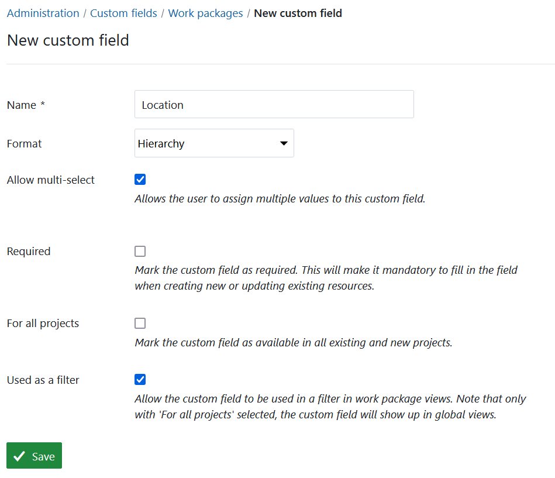

---
sidebar_navigation:
  title: Custom fields
  priority: 960
description: Manage custom fields in OpenProject.
keywords: manage custom fields
---
# Manage custom fields

You can **create additional custom fields for different sections**, e.g. work packages, projects, users or groups in OpenProject.

Custom fields enable to configure your OpenProject exactly to your needs, i.e. to adapt work package forms to your company specific requirements.

<video src="https://openproject-docs.s3.eu-central-1.amazonaws.com/videos/OpenProject-Forms-and-Custom-Fields-1.mp4" type="video/mp4" controls="" style="width:100%"></video>

## Add a new custom field

To **create a new custom field** navigate to *Administration* -> *Custom fields* and select the section for which you will create a new custom field, e.g. for work packages.

You will see the list of all the custom fields that have been created so far, divided by the section on the different tabs for which they were created.

If none have been created so far, click on the link **Create a new custom field** in the respective section, e.g. on the tab for work packages.

Depending on the module, for which the new custom field is being  created, slightly different options may be offered. This is an example of a new custom field for a work package.

1. Custom field **Name**, which will appear as the attribute name on the work package form.
2. Choose a **Format** of the custom field, e.g. text, list, date, boolean. In this example the format *Text* is selected.

> [!TIP]
> Depending on the format of the custom field, the fields to specify vary.
4. Specify the **minimal and maximal length**. If a 0 is chosen, no restriction will be imposed on the length of the custom field.
5. **Regular expression** specifying which values are allowed for the custom field.
6. **Default value** will be used as a default value for the custom field.
7. Set if the new custom field should be a **required** field.
8. Specify if the new custom field should be **used for all projects**. This means the custom field will be active for all projects and does not need to be activated separately per project.
9. Specify if the new custom field should be **used as a filter for work packages**. See [here](../../user-guide/work-packages/work-package-table-configuration/#filter-work-packages) how to filter work packages.
10. Specify if the new custom field should be **searchable** via the global search.
11. **Save** the new custom field.

## Custom field formats

There are multiple format options for custom fields in OpenProject. You can select one of the following formats: 
- **Text custom field** - creates a custom field in text format with the specified length restrictions.
- **Long text custom field** - creates a custom field for cases where longer text needs to entered.
- **Link (URL) custom field** - creates a custom field for URLs.
-  **Integer custom field** - creates a custom field for integers.
-  **Float custom field** - creates a custom field for rational numbers.
-  **List custom field** - creates a custom field with flat list options. 
-  **Date custom field** - creates a custom field, which allows selecting dates from a date picker.
-  **Boolean custom field** - creates a custom field for an attribute, that is either true or false. It is represented by a checkbox that can be checked or unchecked.
-  **User custom field** - creates a custom field, which allows selecting users that are allowed to access the entity containing the custom field.
- **Version custom field** - creates a custom field, which allows selecting one or multiple versions. Versions are created on the project level in *Backlogs* module.
- **Hierarchy custom field (Enterprise add-on)** - see more in the section below.

### Hierarchy custom field (Enterprise add-on)

> [!NOTE]
> Custom fields with type Hierarchy are an Enterprise add-on. Click here for more information on the [OpenProject Enterprise edition](https://www.openproject.org/enterprise-edition/).

Hierarchy custom fields allow organizing hierarchical structures in work packages by making use of multi-level select lists. To create a custom field of type Hierarchy follow the same steps as you would when [creating a standard custom field](#add-a-new-custom-field) and select **Hierarchy** format. You can then name the custom field, allow multi-select, specify if it should be a required field or used as a filter, and activate it for all projects. Click the **Save** button to proceed.

You will then see the list of all existing custom fields. Click on the name of the custom field you created to edit it, specify selectable items and assign it to projects.

You can edit the name and initial settings under the *Details* tab. 

Under the *Items* tab you can specify which hierarchy items should be selectable for this specific custom field. Initially the list of items will be empty.To add items, click the **+Item** button. 

You can then specify labels and short names for each of the items you want to add. The short name can be used e.g. for an abbreviation of a name or another associated short description. The short name will be displayed next to the item label in brackets. 

All items you add here will constitute one hierarchical level. You can add further levels to each of the items. Here you can edit the items, change the position in the list or delete the items. To do that click the icon with the three dots on the far right and select the respective option. You can also re-arrange the items by dragging and dropping.

You can add further hierarchical levels by clicking on the name of the item and adding the items same way you did on the first level. Once you do that, the number of sub-items will be displayed on the higher hierarchy level. 

You can add as many sub-times and hierarchy levels as you need. You can always navigate to the level you need by clicking the respective option from the hierarchy path displayed above the items.

Once you have specified all items for the hierarchy custom field, you need to: 

1. [Activate this custom field for projects under the *Projects* tab](#add-a-custom-field-to-one-or-multiple-projects)
2. [Assign a custom field to a work package type](../manage-work-packages/work-package-types/#work-package-form-configuration-enterprise-add-on) 

##  Create a multi-select custom field

For work package custom fields of type **List**, **User**, **Version** and **Hierarchy** you may also select **multi-select custom fields** to select more than one value at once.

To create a multi-select custom field follow the same steps as you would when [creating a standard custom field](#add-a-new-custom-field). Select format **List**, **User**, **Version** or **Hierarchy **and check the option *Allow multi-select*.

When using multi-select custom fields, you can add as many options as required. The cross icon next to an option will remove it from the selection. The check mark will save your changes.

## Assign a custom field to a work package type and project

> [!IMPORTANT]
> Custom fields need to be activated per work package type and added to a project. Work package custom fields are only visible when two conditions are met:
>
> 1. Custom field has been added to the work package type (form configuration).
> 2. Custom field is activated for the project.

### Assign a custom field to a work package type (Enterprise add-on)

You can [assign a custom field to a work package type](../manage-work-packages/work-package-types/#work-package-form-configuration-enterprise-add-on) (form configuration) directly via the link in the custom field overview.

> [!IMPORTANT]
> Starting with OpenProject 15.0, when adding new custom fields to a type through the  form configuration, the added custom fields will not automatically be enabled in all projects that have this work package type currently enabled.

### Add a custom field to one or multiple projects

You can activate the custom field for specific projects under the respective [project settings](../../user-guide/projects/project-settings/custom-fields/). 

> [!TIP]
> This is not relevant if the setting **For all projects** has been configured for the custom field.

You can active a custom field for multiple projects at once by opening the custom field in question and selecting the *Projects* tab. Click the **Add projects** button.

Use the search field to identify the projects and select multiple projects at once. You can also include the sub-projects by checking the respective option. Click the **Add** button to active the custom fields in all of the selected projects.

## Edit or remove a custom field

To **edit an existing custom field** select the appropriate tab and click on the custom field name.

To **delete** a custom field, click on the delete icon next to the respective custom field in the list.

