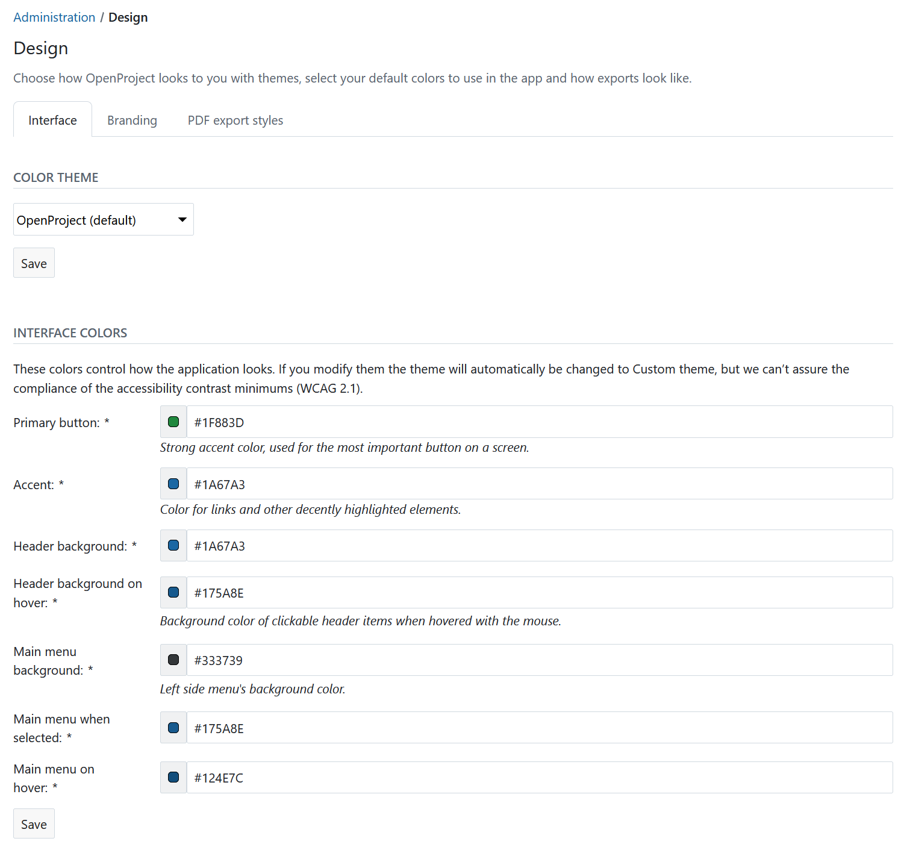
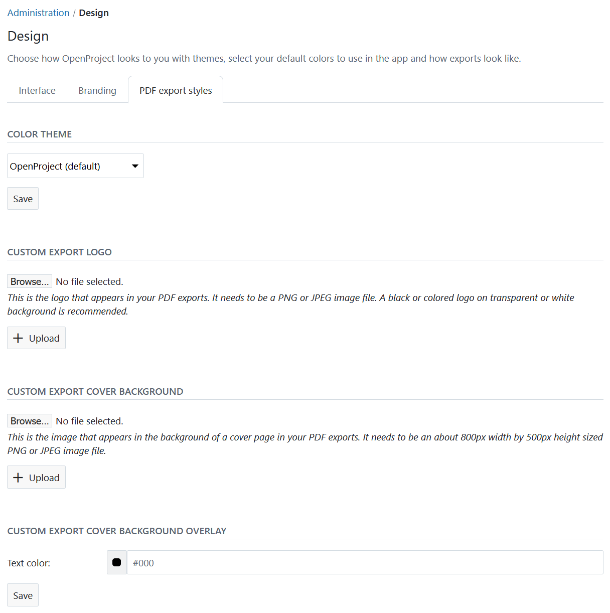
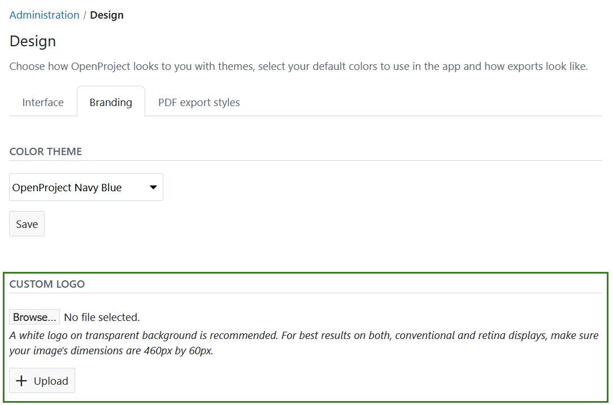
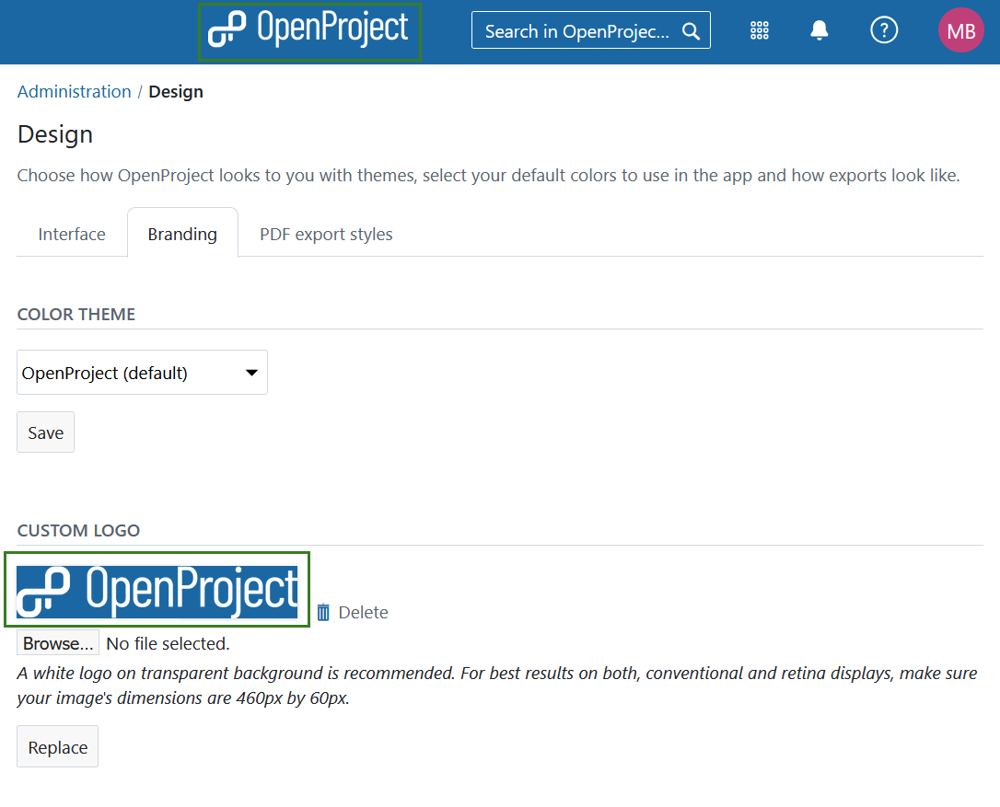

---
sidebar_navigation:
  title: Design
  priority: 870
description: Custom color, theme and logo.
keywords: custom color, theme and logo
---
# Set custom color theme and logo (Enterprise add-on)

As an OpenProject Enterprise add-on you can replace the default  OpenProject logo with your own logo. In addition, you can define your own color theme which allows you to implement your corporate identity in OpenProject.

Navigate to *Administration* -> *Design* in order to customize your OpenProject theme and logo.

The design page provides several options to customize your OpenProject Enterprise edition, grouped under three tabs, **Interface, Branding, PDF export styles**. You can [choose a color theme](#choose-a-color-theme) under any of these tabs. 

Under **Interface** you can also choose [custom colors](#interface-colors) for elements of the interface such as the primary button color, accent color, the background of the top navigation header and the main menu.

Under the **Branding** tab you can also [upload a custom logo](#upload-a-custom-logo) to replace the default OpenProject logo, [set a custom favicon](#set-a-custom-favicon), which is shown as an icon in your browser window/tab, and [upload a custom touch icon](#set-a-custom-touch-icon), which is shown on your smartphone or tablet when you bookmark OpenProject on your home screen.

Under **PDF export settings** you can set the preferences for [exporting work packages in a PDF format](../../user-guide/work-packages/exporting/#pdf-export).

## Choose a color theme

You can choose between the three default color themes for OpenProject:

* OpenProject
* OpenProject Gray (previously called OpenProject Light)
* OpenProject Navy Blue (previously called OpenProject Dark)

Press the Save button to apply your changes. The theme will then be changed.

## Upload a custom logo

To replace the default OpenProject logo with your own logo, make sure that your logo has the dimensions 460 by 60 pixels. Select the *Browse* button and select the file from your hard drive to upload it.

Click the *Upload* button to confirm and upload your logo.

## Set a custom favicon

To set a custom favicon to be shown in your browser’s tab, make sure  you have a PNG file with the dimensions 32 by 32 pixels. Select the *Choose File* button and select the file from your hard drive to upload it.

Then click the *Upload* button to confirm and upload your favicon.

## Set a custom touch icon

To set a custom touch icon that appears on your smartphone’s or  tablet’s homescreen when you bookmark a page, make sure you have a PNG  file with the dimensions 180 by 180 pixels. Select the *Choose File* button and select the file from your hard drive to upload it.

Click the *Upload* button to confirm and upload your custom touch icon.

When you bookmark your OpenProject environment’s URL, you will see that the uploaded icon is used as a custom touch icon.

## Interface colors

Aside from uploading logos and icons, you can also customize the colors used within your OpenProject environment.

To do this, enter the hex value for any color you would like to change. You can use a website like [htmlcolorcodes.com](https://htmlcolorcodes.com/color-picker/) to help you find the perfect color.
You can see the selected color in the preview area next to the color hex code. Therefore, it is possible to see the selected color before saving the changes.

> [!TIP]
> If the button color you select is too light to have white text on top of it, the icon and text color will be displayed in black instead.

As soon as you press the **Save** button your changes are applied and the colors of your OpenProject environment are adjusted accordingly.
