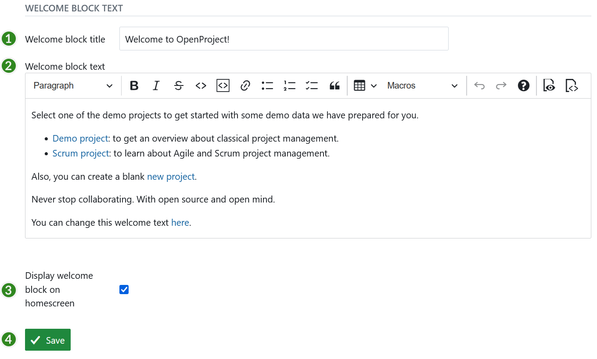

---
sidebar_navigation:
  title: General settings
  priority: 990
description: General system settings in OpenProject.
keywords: general settings
---
# General system settings

You can configure general system settings in OpenProject. Under System settings on the tab **General** you can configure the following options.

1. **Application title**: This title will be displayed on the [application start page](../../../user-guide/home/).

2. **Object per page options** define the options of how many objects  (for example work packages or news entries) you can have displayed on one page. This is used for the pagination in the work package table. You can enter several values, separated by coma. Please note that the higher value you set, the more work packages will be initially loaded and therefore it might take longer time to load a work package page.

3. **Days displayed on project activity** determines how far back the project activities will be traced and displayed in the project's [Activity](../../../user-guide/activity).

4. **Host name** defines the host name of the application. In many installation types (docker, packaged, cloud), this setting will be configured through an environment variable and is not user-editable.

5. **Cache formatted text** allows to save formatted text in cache, which will help load Wiki Pages faster.

6. **Enable feeds** – enables RSS feeds on wiki pages, forums and news via RSS client.

7. Set **feed content limit**.

8. **Work packages and projects export limit** defines the maximum items a structured export for work packages and projects can contain (i.e., lines of CSV, XLS etc.). Increasing this value allows you to export more items at once, but at the cost of higher RAM consumption. If you're experiencing errors exporting with a high value, try reducing this number first.

9. **Max size of text files displayed inline** defines the maximum file size up to which different versions of a file are displayed next to each other when comparing (diff) two versions in a repository.

10. **Max number of diff lines displayed** defines the maximum number of lines displayed when comparing (diff) two versions in a repository.

11. **Display security badge** enables to display a badge with your installation status in the [Information administration panel](../../information), and on the [start page](../../../user-guide/home/). It is displayed to administrators only.

> [!NOTE]
> If enabled, this will display a badge with your installation status in the [Information](https://qa.openproject-edge.com/admin/info) administration panel, and on the home page. It is displayed to administrators only.
> The badge will check your current OpenProject version against the official OpenProject release database to alert you of any updates or known vulnerabilities. For more information on what the check provides, what data is needed to provide available updates, and how to disable this check, please visit [the configuration documentation](../../../system-admin-guide/information/#security-badge).

## Welcome block text

Create a welcome text block to display the most important information to users on your [application start page](../../../user-guide/home/).

1. Insert a **welcome block title**.

2. Add the **welcome block text description**. You can add the same formatting options, as well as macros (work package lists etc.) as for the general text blocks.

3. Select to **display welcome block on homescreen** of the application.

4. Do not forget to **save** your changes.

   
