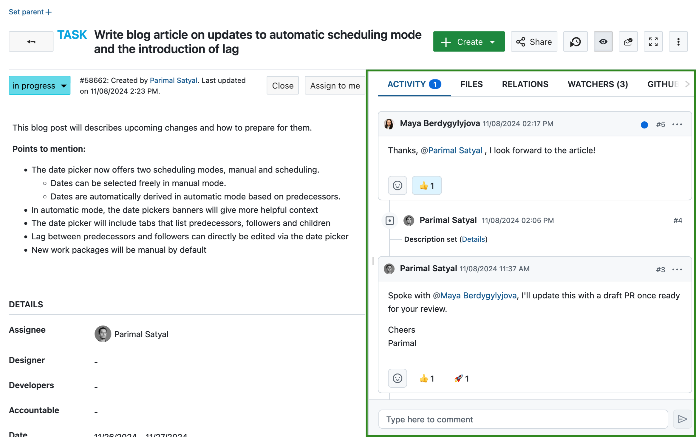

---
sidebar_navigation:
  title: Activity
  priority: 890
description: Get an overview of changes and comments within a single work package or the latest activity within a project. The activity tab in work packages also lets you mention and notify other users.
keywords: activity, comment, mention, emoji, reaction
---

# Project and work package activity

OpenProject makes it easy to keep track of what's going on in [specific work packages](#work-package-activity) and in your [projects](#project-activity).

## Work package activity

The Activity tab within a work package maintains a history of all updates and changes, along with all conversations concerning that work package. This tab is accessible both in full work packages view and in split screen mode.

When you first access this tab, you will see the comments and list of changes in a timeline. This timeline can be sorted in either chronological (the newest comments at the bottom) or anti-chronological order (the newest comments on top):

You can scroll up and down to go forwards or backwards in time.

By default, the activity tab shows both comments and changes, but you can filter this to only show one or the other:

### Change sets

When you or another user makes changes to the work package, the updates are listed below the name of the author of those changes. All changes made within the aggregation period (defined by the administrator) are grouped together under one change set.

If a comment was also added, then the changes are listed below the associated comment.

### Comments

Comments allow you to have a conversation about the present work package with other project members, or comment changes you have made.

To add a new comment to a work package, click on the comment box at the bottom of the Activity tab. This will expand it and give you formatting options. Click on the post icon or press Command + Enter on your keyboard to publish your comment.

The more icon (⋯) next to a comment gives you a number of additional functions.

You can:

- Copy a link to the comment on your clipboard if you want to paste a link to it elsewhere  
- You can edit the comment if you are the author  
- You can quote someone else's comment in a new comment. This is useful if you want to respond to a certain part of a comment.

### Emoji reactions

Starting with version 15.0, you can respond to comments with emoji reactions to quickly communicate basic messages without having to add a comment.

To do so, click on the emoji icon next to each comment and pick from one of eight possible emojis.

You can add multiple emojis, or simply click on an emoji that was already used by someone else to add to it.
> [!TIP]
> Please note that emoji reactions will not trigger notifications. If you need your colleague to be notified about your reaction, leave a regular comment.

### Mentions

If you would like to direct your comment to particular project members or get their attention, you can @mention them. To do this, type `@` and select the user whom you want to mention.

The user will then receive a notification, which allows them to easily see the comment in which they have been mentioned.

### Automatic updates 

Starting with OpenProject 15.0, changes other users make to the currently open work package are visible nearly immediately, in real-time. For example, if someone changes the assignee, edits the description and leaves a comment, all of these things will automatically be reflected in the open work package without any action on your part.

> [!TIP]
> If you are currently editing a work package and someone else edits it at the same time, you will receive a warning letting you know that you will not be able to save your changes till your refresh the page. This gives you the opportunity to copy your work elsewhere so that it isn't lost, and that your edit do not overwrite those of someone else.

## Project activity

OpenProject lets you view an overview of all recent changes within a project. These include changes to:

- work packages (new work packages, new comments, changes to status, assignee, dates, custom fields...)
- project attributes (name, description, custom fields..)
- other modules (news, budget, wiki edits, forum messages, logged time...)

To view project activity, the **Activity** module must first be enabled.

### Activate project activity

Within a project, navigate to the **Project settings > Modules** page. Make sure the **Activity** module is enabled and click on the **Save** button at the bottom of the page.

### View project activity

Click on the **Activity** option that is now visible in the sidebar of a project. This will show you recent activity in the project, with the most recent changes at the top.

For each update concerning a work package, you will see:

- the work package id and title
- the name of the project or sub-project that work package belongs to (in brackets)
- the user who was responsible for the change
- the date and time of the (aggregated) changes
- a list of attributes that were changed

Starting with version 12.5, the Activity module also lists changes to project attributes, including project custom fields. For each update, you will see:

- the name of the project or sub-project
- the user who was responsible for the change
- the date and time of the (aggregated) changes
- a list of attributes that were changed

### Filter project activity

To filter the project activity list, use the filters on the sidebar. You may filter to show only one or a combination of changes concerning:

- Budgets
- News
- Spent time
- Wiki edits
- Work packages
- Project attributes

Additionally, you can choose to include or exclude updates concerning sub-projects.

### How far back can I trace the project activities?

The retrospective for the project activities is not limited. You can therefore trace all the project activities back to the beginning of the project.
You can [configure in the admin settings](../../system-admin-guide/) how many days are shown on each activity page. Due to performance reasons, the days displayed should be set at a low level (e.g. 7 days).

> **Note:** The project activity list is paginated. You can click on the "Previous" or "Next" links at the bottom of the page (where applicable) to navigate between pages.

